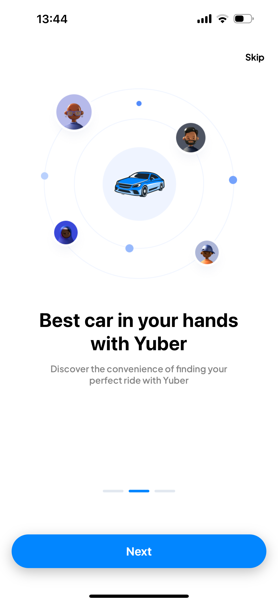

# Social Media App with Expo Go and Supabase

Yuber is a ride-booking application that provides a seamless and secure user experience. The app features full user authentication and sign-in with Google, powered by Clerk, ensuring a streamlined registration and login process. User data is securely stored on Neon, a serverless Postgres platform. Yuber's main screens include a ride history view, a user profile section, and a booking interface. To book a ride, users select their start location—defaulting to their current location—and choose a destination. Yuber then suggests nearby drivers, providing detailed information such as pricing, distance, fees, and available car seats. Payment for rides is conveniently handled through Stripe, allowing users to enter their payment details and confirm their ride with ease. Once payment is complete, users are ready to embark on their journey.

Tools Used: React Native, Expo Go, Clerk, Neon, Stripe, Geoapify, TailWindCSS

## Demo Images

### Onboarding Screens

  

### Sign up / Sign in Screens / Google Login

  

### Main Tab Layout

   

### Choose Ride Screen

 

### Choose Driver Screen

 

### Confirm Screen


### Stripe Pay Modal Screen

  

### Complete Screen


# Welcome to your Expo app 👋

This is an [Expo](https://expo.dev) project created with [`create-expo-app`](https://www.npmjs.com/package/create-expo-app).

## Get started

1. Install dependencies

   ```bash
   npm install
   ```

2. Start the app

   ```bash
    npx expo start
   ```

In the output, you'll find options to open the app in a

- [development build](https://docs.expo.dev/develop/development-builds/introduction/)
- [Android emulator](https://docs.expo.dev/workflow/android-studio-emulator/)
- [iOS simulator](https://docs.expo.dev/workflow/ios-simulator/)
- [Expo Go](https://expo.dev/go), a limited sandbox for trying out app development with Expo

You can start developing by editing the files inside the **app** directory. This project uses [file-based routing](https://docs.expo.dev/router/introduction).

## Get a fresh project

When you're ready, run:

```bash
npm run reset-project
```

This command will move the starter code to the **app-example** directory and create a blank **app** directory where you can start developing.

## Learn more

To learn more about developing your project with Expo, look at the following resources:

- [Expo documentation](https://docs.expo.dev/): Learn fundamentals, or go into advanced topics with our [guides](https://docs.expo.dev/guides).
- [Learn Expo tutorial](https://docs.expo.dev/tutorial/introduction/): Follow a step-by-step tutorial where you'll create a project that runs on Android, iOS, and the web.

## Join the community

Join our community of developers creating universal apps.

- [Expo on GitHub](https://github.com/expo/expo): View our open source platform and contribute.
- [Discord community](https://chat.expo.dev): Chat with Expo users and ask questions.
